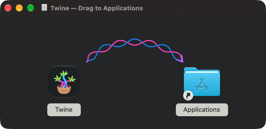
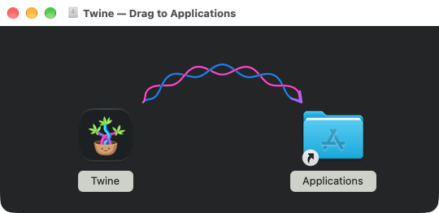

The stable and nightly DMGs use `installer-background.tiff`, generated from the
approved braided arrow in `installer-background.svg`. Blue and pink strands
form six alternating crossings with wider loops, ending in a purple arrowhead.
The TIFF contains 540 × 232 at 72 DPI and 1080 × 464
at 144 DPI, with the same logical size, for standard and Retina displays.

Finder treats windows with background artwork as having a fixed appearance and
renders filenames in black ([Finder background limitations](https://c-command.com/dropdmg/help/layouts)).
The artwork keeps a charcoal canvas in both appearances and uses light
backplates behind the native filename labels. The title bar follows macOS.
Icons and filenames come from Finder; they are not painted into the background.

To change the artwork and regenerate its committed TIFF:

```sh
make regenerate-dmg-artwork
make check-release
```

`make release-package` and `make nightly-package` install the pinned `ds-store`
and `mac-alias` tools into `target/dmg-tools`. Packaging creates a writable HFS+
image, writes its Finder layout using the actual mounted volume's metadata,
ejects it, and converts it to the final compressed UDZO image. The background
alias resolves by volume identity and file catalog ID, including after the
image is downloaded and mounted somewhere else. No Finder or AppleScript is
required during packaging. The background stays hidden; only `Twine.app` and
the Applications shortcut are visible. Packaging tests mount both release types
at a different path, verify the alias and artwork, install the app, eject the
image, and execute the installed fixture.

Actual mounted Finder window in dark and light system appearances:




