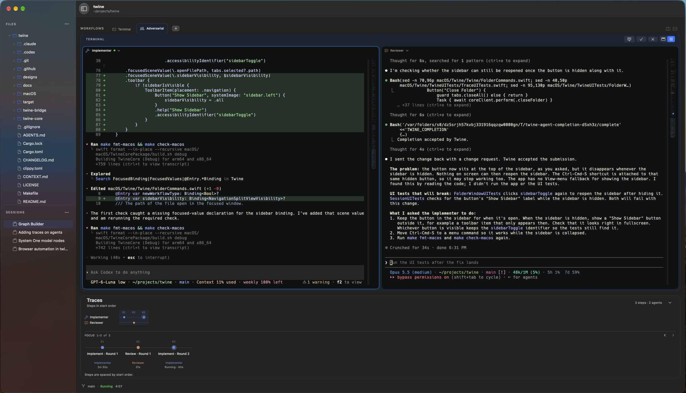

<p align="center">
  
</p>

<h1 align="center">Twine</h1>

<p align="center">A native macOS workspace for coordinating coding agents.</p>

<p align="center">
  <a href="https://github.com/aravind-n/twine/releases/latest">
    
  </a>
  <a href="https://github.com/aravind-n/twine/actions/workflows/ci.yml">
    
  </a>
  <a href="#try-twine">
    
  </a>
  <a href="LICENSE">
    
  </a>
</p>

<p align="center">
  <a href="#about">About</a> ·
  <a href="#try-twine">Try Twine</a> ·
  <a href="docs/reference.md">Reference</a> ·
  <a href="https://github.com/aravind-n/twine/issues">Feedback</a>
</p>

> [!NOTE]
> Twine is in early development. Features, integrations, and interfaces are still
> changing. Download a packaged release below, or build from source.

<p align="center">
  
</p>

## About

Twine brings your terminals, coding agents, files, and workflow history into one
macOS app. Open a folder, organize work into sessions, and choose how agents work
on a task: individually, in an implementation and review loop, or with a
coordinator assigning work to parallel workers.

You work directly with each agent in its terminal. Twine adds roles, handoffs,
and a record of what happened around the command-line tools you already use.
Each role can use a different harness and, where supported, a different model.

The app uses SwiftUI and AppKit, with a Rust application core and
[SwiftTerm](https://github.com/migueldeicaza/SwiftTerm) for terminal emulation.

## What you can do today

- **Work in multiple folders.** Keep each folder in its own window with independent
  terminals and tabs, and restore open folders when Twine relaunches.
- **Work in terminals.** Run shells and agents, split a terminal into up to four
  panes, and paste images or drop files into a pane as paths.
- **Coordinate agents.** Use built-in Adversarial and Coordinator workflows with
  explicit completions and handoffs. Each role has its own terminal.
- **Define workflow types.** Add roles, instructions, stages, parallel roles,
  handoffs, and bounded review loops in the visual designer.
- **Follow the work.** Inspect workflow activity in Traces and jump to recorded
  terminal output where an anchor is available. Supported harness hooks add
  prompt, tool, and response events.
- **Return to earlier work.** Restore sessions, pane layouts, and retained
  terminal output. Resume a recorded harness conversation when its session
  handle is available.
- **Make small file edits.** Browse the open folder and edit UTF-8 text files up
  to 2 MiB, with undo and checks for changes made on disk before saving.

See the [reference](docs/reference.md) for detailed behavior and limits.

## Workflows

A **session** is a named body of work in a folder. Each top-level tab in that
session is a **workflow**. A workflow type defines how its agents are coordinated;
a **harness** is the external agent tool filling a role.

| Workflow type | How it works |
| --- | --- |
| Terminal | A plain shell, with optional split panes. |
| Single agent | One interactive coding agent. |
| Adversarial | An implementer does the task; a reviewer approves it or requests changes. Review loops are bounded. |
| Coordinator | A coordinator assigns sub-tasks to parallel workers, then gathers and checks their results. |
| Custom | Your own roles, stages, handoffs, and review loops, saved as a reusable workflow type. |

Agents advance a multi-agent workflow by submitting an explicit completion.
**Mark done…** also lets you submit a completion, review decision, or assignment
from the app. After completing an assignment, an agent's terminal remains
interactive for follow-up prompts.

Agents run directly in the open folder. Parallel file ownership is advisory;
Twine does not create isolated worktrees for workers.

## Supported harnesses

Twine currently has adapters for:

| Harness | Command on your shell's PATH |
| --- | --- |
| Codex | `codex` |
| Claude Code | `claude` |
| pi | `pi` |
| Antigravity | `agy` |
| OMP | `omp` |
| OpenCode v2 | `opencode` |

Install and authenticate the harnesses you want to use separately. Twine
discovers model choices from their CLIs; model and effort options depend on the
harness. Provider access and usage charges follow your harness configuration.
You can use Terminal workflows without installing an agent harness.

Prompt and tool tracing is currently available through launch-only observers for
Codex, Claude Code, pi, and OMP. Antigravity and OpenCode retain lifecycle and
workflow traces. Compatibility depends on CLI versions; see the
[integration notes](docs/reference.md#agent-workflows).

## Try Twine

Twine currently targets **macOS 26 or later**, on **Apple Silicon and Intel**.

Download `Twine-0.1.0-macos-universal.zip` from the
[v0.1.0 release](https://github.com/aravind-n/twine/releases/tag/v0.1.0), extract it,
and move `Twine.app` to Applications. The app is ad hoc signed and not notarized;
follow the included `README.txt` or the [install notes](docs/reference.md#install)
for first-launch approval.

Open a folder, create a session, and choose a workflow in a new tab. For an agent
workflow, choose the harness for each role, then enter your task in the first
agent's terminal.

### Build from source

To build from source, you will need:

- **Xcode 27.0**, selected as the active developer toolchain. Command Line Tools
  alone are insufficient for the app's build plugins.
- The **Xcode Metal Toolchain**. If missing, install it with
  `xcodebuild -downloadComponent MetalToolchain`.
- **Stable Rust**, installed through `rustup`, with both macOS targets.

```sh
git clone https://github.com/aravind-n/twine.git
cd twine
rustup target add aarch64-apple-darwin x86_64-apple-darwin
make framework
open macOS/Twine/Twine.xcodeproj
```

In Xcode, select the **Twine** scheme, trust the SwiftTerm build plugin when
prompted, and run the app. Xcode uses the prebuilt Rust framework; rebuild it with
`make framework` after Rust changes. For a command-line build, use
`make build-macos`.

## Settings and saved work

Twine creates `~/.config/twine/config.toml` on first launch and reads it at startup.
For example:

```toml
[terminal]
font_family = "JetBrains Mono"
font_size = 13.0
```

Install the font in macOS, or omit `font_family` to use the system monospace font.
Restart Twine after editing settings. Appearance settings are parsed but are not
applied yet.

Application data is stored in `~/Library/Application Support/Twine`. Recorded
terminal output has retention limits of 64 MiB per terminal and 512 MiB overall,
with additional metadata limits. Older output can expire. Tracing is best effort,
and resuming work depends on the harness and its recorded session handle. See
[configuration](docs/reference.md#configuration) and
[terminal transcripts](docs/reference.md#terminal-transcripts).

## Development and feedback

The Rust core lives in `twine-core`, the C ABI in `twine-bridge`, and the native app
in `macOS`. The [development reference](docs/reference.md#development-setup)
describes the build and test setup; [CONTEXT.md](CONTEXT.md) defines the concepts
used throughout the codebase.

From the repository root:

```sh
make check          # Rust and Swift formatting checks, lint, and unit tests
make fmt            # Format Rust and Swift
make ui-test-macos  # Default UI suite; takes over the desktop
```

Bug reports, reproducible examples, and feedback on real workflows are welcome
in [GitHub Issues](https://github.com/aravind-n/twine/issues). Include your macOS,
Twine, and harness versions, what you expected, and what happened. For larger
contributions, open an issue to discuss the change before starting. Repository
guidance is in [AGENTS.md](AGENTS.md).

## Acknowledgments

Thank you to [AI Tinkerers Seattle](https://seattle.aitinkerers.org/) for the
opportunity to demo and premiere Twine.

Twine's terminal emulation uses [SwiftTerm](https://github.com/migueldeicaza/SwiftTerm).

## License

Twine is available under the [MIT License](LICENSE).
